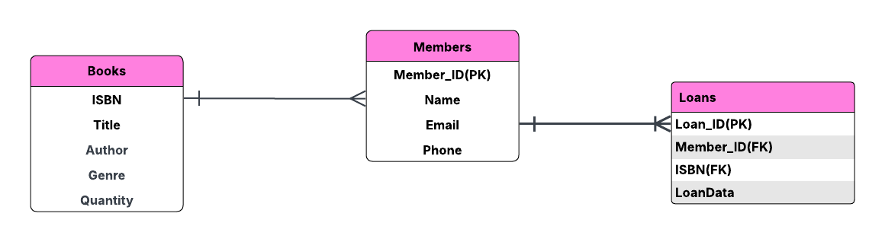

# Library book Loans system 

## Overview
This project involves the creation of a **Library Management System** using a relational database. The system allows you to manage books, members, and loans, including operations such as borrowing books, updating book quantities, and deleting members.

This repository contains:
- The **ER Diagram** that visually represents the entities and relationships in the library database.
- The **Database SQL file** that contains the SQL commands for creating the database, tables, and inserting data.
- Screenshots of the database records and operations to demonstrate functionality.

## Features
- **Books**: Stores information about books such as ISBN, Title, Author, Genre, and Quantity.
- **Members**: Stores information about library members, including MemberID, Name, Email, and Phone.
- **Loans**: Tracks the books borrowed by members, including LoanDate and ReturnDate.

### Key Operations:
- **Retrieve all information about books borrowed by a specific member**
- **Update the quantity of a particular book**
- **Delete a member record**

## Database Schema

The database contains the following tables:

1. **Books**
   - ISBN (Primary Key)
   - Title
   - Author
   - Genre
   - Quantity

2. **Members**
   - MemberID (Primary Key)
   - Name
   - Email
   - Phone

3. **Loans**
   - LoanID (Primary Key, Auto Increment)
   - MemberID (Foreign Key referencing Members)
   - ISBN (Foreign Key referencing Books)
   - LoanDate
   - ReturnDate

## ER Diagram

Below is the Entity-Relationship diagram representing the relationships between **Books**, **Members**, and **Loans**.

## Database SQL File

The `database.sql` file contains all necessary SQL statements to:
- Create the database.
- Create tables.
- Insert sample data.
- Perform operations such as retrieving books borrowed by a member, updating book quantities, and deleting members.

> **Note:** Make sure to update the paths and ISBNs as needed in the SQL file before running it.
